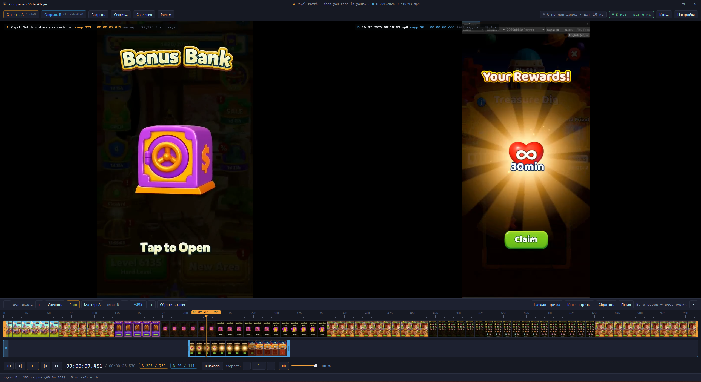

# CVP

**Видеоплеер для Windows для покадрового воспроизведения и сравнения двух роликов:**
точный шаг по кадрам, синхронное воспроизведение двух треков
и насртройка таймлайнов относительно друг друга.

## Зачем

Воспроизводить видео покадрово.
Сравнить два варианта одного ролика — до и после рендера, две настройки кодека,
запись из движка и эталон — обычным плеером неудобно: нет точного шага назад,
нет способа совместить ролики по времени, нет отрезка для повторного просмотра.
Здесь всё это есть, а покадровый шаг остаётся мгновенным даже на 4K long-GOP —
плеер сам собирает кэш кадров, когда прямой декод оказывается медленным.

## Возможности

**Покадровая точность**
- Шаг ровно на один кадр вперёд и назад (`←` / `→`), крупный шаг с `Shift`.
- Промотка колесом над кадром: медленное вращение — по кадру, быстрое — крупным шагом.
- Шаттл `J` / `K` / `L`: назад · стоп · вперёд, повторное нажатие удваивает скорость.
- Таймкод и номер кадра поверх картинки и в транспорте, панель сведений о ролике
  (fps, длительность, число кадров, флаг VFR).

**Два трека и синхронизация**
- Единый мастер-клок: транспорт управляет обоими треками, позиция ведомого =
  время мастера минус сдвиг трека.
- Выравнивание роликов перетаскиванием клипа по таймлайну или `Alt` + стрелки
  (с точностью до кадра), `Alt+0` — сброс сдвига.
- Разные fps у треков поддержаны: шаг задаётся кадрами мастер-трека, ведомый
  подбирает ближайший кадр по времени.
- Раскладка «рядом / только A / только B» (`V`), выбор мастер-трека (`M`).

**Таймлайн видеоредактора**
- Линейка с зумом колесом к точке под курсором и панорамированием, снэп к
  границам кадров (`S`), «уместить всё» (`F`).
- Отрезок воспроизведения ручками на клипе или клавишами `I` / `O`,
  петля по отрезку (`Ctrl+L`).
- Playhead с покадровым скрабом, миниатюры кадров и полоса готовности кэша прямо на клипе.
- Флажок «Пауза при переходе» на панели инструментов: переход по шкале либо
  останавливает плеер на нужном кадре, либо продолжает воспроизведение с нового места.
- Компактный вид (`Ctrl+T`): таймлайн и транспорт сворачиваются в одну полосу
  прогресса — плеер стартует в нём.

**Кэш кадров (ffmpeg)**
- Плеер один раз замеряет шаг назад на открытом файле и, если он медленнее порога
  (по умолчанию 250 мс), в фоне строит all-intra прокси через ffmpeg: 4K H.264 GOP 250
  ускоряется с ~1018 мс до ~7 мс на шаг.
- Кэш переиспользуется между запусками (ключ — файл + параметры), частота прокси
  настраивается, объём ограничен (по умолчанию 20 ГБ) с вытеснением по LRU.
- Режимы «авто / всегда / никогда», отдельная панель кэша (`C`): пересобрать,
  играть с исходника, открыть папку, очистить.

**Открытие файлов**
- Ролик открывается из диалога, перетаскиванием, из командной строки (`CVP a.mp4 b.mp4` —
  сразу в оба трека) и через «Открыть с помощью» проводника.
- Регистрация типов файлов ставится при установке (галочка в мастере) или в настройках,
  раздел «Типы файлов»; там же — кнопка в системное окно «Приложения по умолчанию».

**Связь с Unity**
- Кнопка «Unity» включает внешнее управление: плеер слушает именованный канал Windows.
- Пакет [CVP Link](unity/com.cvp.link) даёт `CvpPlayer.Play()` и остальной транспорт из
  любого места кода — отрезок выставляется в плеере, игра только запускает его.
- Окно `Window → CVP Link` в редакторе показывает состояние связи и даёт кнопки транспорта.

## Установка

Готовая поставка — на странице [релизов](https://github.com/Visp1024/ComparisonVideoPlayer/releases/latest),

## Известные ограничения

- При воспроизведении картинка второго окна отстаёт на 0,1–0,2 с (у каждого трека
  свой FlyleafHost); покадровое сравнение делается на паузе и шаге — там кадры точны.
  Общий рендер-таргет запланирован отдельной задачей.
- VFR-ролики: «номер кадра» производный от timestamp; в кэш-режиме прокси нормализует fps.
- Два файла, выделенные в проводнике, «Открыть с помощью» отдаёт разным копиям плеера:
  сравнение пары по-прежнему собирается перетаскиванием, диалогом или командной строкой.
- Интерфейс пока только на русском.

## Лицензия

[MIT](LICENSE).
