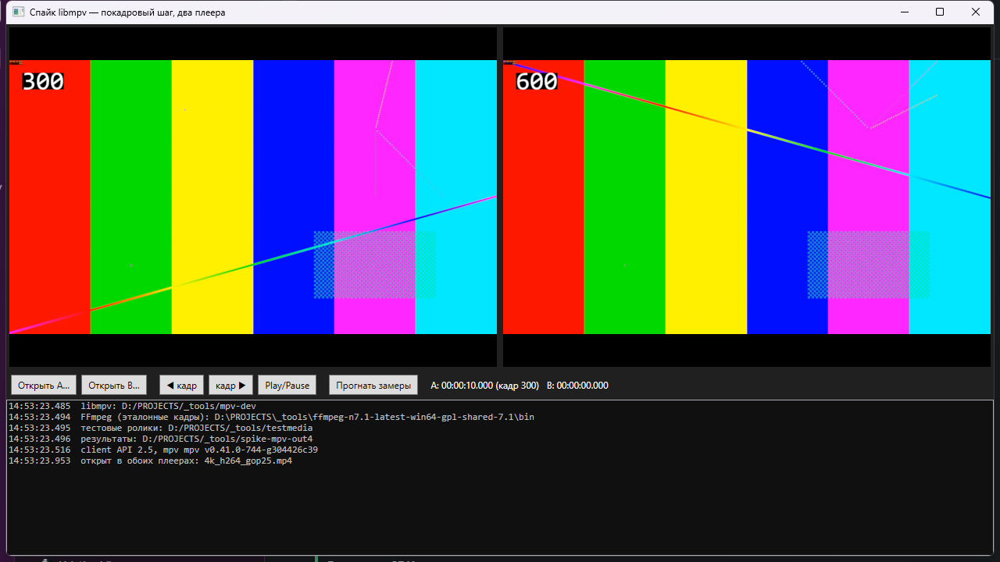

# Фаза 0б — спайк libmpv: запасной бэкенд вместо FlyleafLib

Проверка запасного варианта из [PLAN.md](../PLAN.md), раздел 2. Спайк запускался по условию
из задачи: фаза 0 ([docs/spike-flyleaf.md](spike-flyleaf.md)) не прошла критерий шага назад —
на 4K long-GOP шаг назад в FlyleafLib занимает 1,1 с (H.264 GOP 250) и 0,47 с (HEVC GOP 250)
против порога ~200 мс. Вопрос спайка: даст ли `frame-back-step` у libmpv принципиально
лучший результат, ради которого стоит менять стек.

## Вердикт

**Менять бэкенд не нужно: libmpv не быстрее, а на 5–8 % медленнее FlyleafLib на шаге назад.**

| ролик | шаг назад, FlyleafLib | шаг назад, libmpv | критерий ≤200 мс |
|---|---|---|---|
| H.264 GOP 25 | 68 мс | **85 мс** | оба проходят |
| H.264 GOP 250 | 1112 мс | **1194 мс** | оба **не** проходят |
| HEVC GOP 250 | 469 мс | **494 мс** | оба **не** проходят |

Гипотеза из отчёта фазы 0 подтвердилась: узкое место — не библиотека, а сам декод long-GOP.
Шаг назад в обеих библиотеках = точный seek с декодом от предыдущего ключевого кадра, и обе
не держат буфера уже декодированных кадров назад. Ускорить это может только кэш кадров
(фаза 4) и RAM-буфер вокруг playhead — то есть план из фазы 0 остаётся в силе без изменений.

Что libmpv делает лучше: **точность seek идеальна и подтверждена объективно** (0 кадров
отклонения на всех 24 проверках), и у него нет дефектов FlyleafLib из п. 4 отчёта фазы 0
(зависаний при чередовании способов позиционирования не наблюдалось). Что хуже: интеграция
с WPF — это HWND-хостинг и P/Invoke вместо готового контрола, снимок кадра и параметры потока
приходится добывать командами плеера, а шаг вперёд по умолчанию стоит длительность кадра
(см. п. 3). На чашу весов это не тянет: ради равной или худшей скорости шага назад менять
знакомый C#-стек на C-API смысла нет.

**Рекомендация: оставить FlyleafLib, задачу «Фаза 0б» закрыть, дубликат #10 закрыть тоже.**
Код спайка (`src/Spike.Mpv`) стоит сохранить: если в фазах 1–3 у FlyleafLib всплывут
блокирующие дефекты, готовая обвязка libmpv позволит переключиться без повторного
исследования.

## Что и как измерялось

Мини-приложение `src/Spike.Mpv` (.NET 9, WPF, libmpv из сборки mpv `v0.41.0-744-g304426c39`,
client API 2.5, декод `d3d11va`): libmpv подключён через P/Invoke (`Interop/MpvNative.cs`),
рендер идёт прямо в дочернее Win32-окно внутри WPF-разметки (`MpvHost` — `HwndHost`,
HWND передаётся плееру опцией `wid`). Два независимых экземпляра libmpv в одном процессе
рядом в одном окне:



Ролики, методика и контрольные точки — те же, что в фазе 0, иначе цифры не сравнить:
`testsrc2` 3840×2160, 30 fps, 900 кадров, с впечатанным в кадр номером; H.264 GOP 25,
H.264 GOP 250, HEVC GOP 250; по 30 замеров на серию, рабочая точка — середина файла, с прогревом.

Полные таблицы — [`spike-artifacts-mpv/bench-results.md`](spike-artifacts-mpv/bench-results.md),
рядом `bench-results.json` и `progress.log`. Замеры воспроизводимы: во втором прогоне
([`bench-results-run2.md`](spike-artifacts-mpv/bench-results-run2.md)) медианы шага назад
83,0 / 1194,8 / 498,0 мс против 85,1 / 1194,3 / 493,9 мс в первом — расхождение до 2,5 %.

### Как замерялось «кадр показан» (важно, здесь легко получить неверные цифры)

libmpv сообщает о результате операции двумя разными сигналами, и наивный замер даёт
заниженное время:

| операция | события libmpv | до смены `time-pos` | до `playback-restart` |
|---|---|---|---|
| `frame-step` | property-change | 0,7 мс | не приходит |
| `frame-back-step` | seek, playback-restart, property-change | 84,1 мс | 84,0 мс |
| `seek absolute+exact` | seek, property-change, playback-restart | 3,3 мс | 32,0 мс |

- `time-pos` libmpv выставляет **оптимистично**, сразу по команде seek, до декода — ровно
  как `CurTime` у FlyleafLib (дефект 3 в отчёте фазы 0). Мерить по нему нельзя: получались
  «2–4 мс» на прыжок через 200 кадров long-GOP, чего физически быть не может.
- Решающий сигнал для seek и шага назад — `playback-restart`; для шага вперёд его нет,
  там замер идёт по смене позиции.
- libmpv **досылает** хвосты событий после того, как операция снаружи выглядит завершённой.
  Без «успокоения» плеера (ожидание тишины 60 мс) эти хвосты засчитывались следующему замеру:
  время занижалось, а снимок кадра брался от предыдущей позиции — так у первых прогонов
  seek «промахивался» на ±1 кадр. После починки — 0 промахов.
- Свойство `video-frame-info/pts` (pts реально показанного кадра) в этой сборке libmpv
  недоступно; при его наличии замер был бы ещё точнее, обвязка это учитывает.

## 1. Покадровый шаг (медиана из 30 замеров, мс)

| ролик | шаг вперёд | шаг вперёд, `untimed=yes` | шаг назад | шаг назад через границу GOP |
|---|---|---|---|---|
| H.264 GOP 25 | 33,7 | **0,7** | **85,1** | 71,6 |
| H.264 GOP 250 | 33,7 | **0,8** | **1194,3** | 1205,5 |
| HEVC GOP 250 | 33,7 | **0,7** | **493,9** | 503,5 |

- **Шаг назад повторяет картину FlyleafLib**: цена = декод от предыдущего ключевого кадра,
  серия шагов назад не ускоряется, «через границу GOP» не дороже обычного шага назад.
  Разброс внутри серии большой (min 13–89 мс, max 0,26–1,44 с): дёшево обходятся шаги внутри
  уже раскодированного участка, дорого — всё остальное.
- **Шаг вперёд стоит ровно длительность кадра (33,7 мс при 30 fps)**, а не время декода:
  `frame-step` у mpv показывает следующий кадр «по расписанию» презентации. Это не предел
  декодера — с `untimed=yes` тот же шаг занимает 0,7 мс, как у FlyleafLib. Для приложения
  это значит: при удержании стрелки перемотка вперёд без `untimed` пойдёт со скоростью
  обычного воспроизведения (30 шагов/с), что для покадрового сравнения мало.

## 2. Точность seek

Проверялись кадры 0, 1, 249, 250, 251, 449, 700, 898 (границы GOP, начало и конец файла),
переход — `seek <t> absolute+exact` в середину кадра.

- **Отклонение — 0 кадров во всех 24 проверках** (3 ролика × 8 кадров).
- Проверка объективная, в отличие от полнокадровой метрики фазы 0: снимок плеера
  (`screenshot-to-file ... video`) сравнивается с эталонами ffmpeg для кадров N−1, N, N+1
  **только по области с впечатанным номером кадра** — соседние кадры `testsrc2` почти
  одинаковы, и на полном кадре метрика ничего не доказывала (см. п. 2 отчёта фазы 0),
  а на области с цифрами разница однозначна.
- Снимки подтверждают это и глазами: например
  [кадр 449 H.264 GOP 250](spike-artifacts-mpv/4k_h264_gop250_f449_player.png),
  [кадр 700](spike-artifacts-mpv/4k_h264_gop250_f700_player.png),
  [кадр 251 HEVC](spike-artifacts-mpv/4k_hevc_gop250_f251_player.png).
  В кадр впечатан номер, на единицу больший индекса (`drawtext` считает кадры с единицы):
  на снимке кадра 449 видно «450».
- **Стоимость точного seek через границу GOP — 1,16–1,45 с** (H.264 GOP 250) и 0,76–0,85 с
  (HEVC GOP 250); переход внутри уже раскодированного GOP — 3–16 мс, на GOP 25 — 14–228 мс.
  Тот же порядок, что и у FlyleafLib: скраб по таймлайну на long-GOP без кэша кадров будет
  рваным независимо от выбранной библиотеки.

## 3. Два плеера одновременно

Оба плеера открыты в одном процессе (A: H.264 GOP 25, B: HEVC GOP 250):

| операция | A | B |
|---|---|---|
| шаг вперёд, медиана | 33,7 мс | 33,7 мс |
| шаг назад, медиана | 91,9 мс | 424,2 мс |

- **Взаимного влияния нет**: цифры совпадают с одиночными замерами.
- Ресурсы: ~108 % одного ядра суммарно на серии шагов, working set ~865 МБ на два открытых
  4K-потока — то же, что у FlyleafLib (~180–205 % CPU, ~840 МБ; более низкий CPU у mpv,
  вероятно, оттого, что шаг вперёд у него ждёт презентации кадра, а не упирается в декодер).
- 5 секунд одновременного воспроизведения: позиции продвинулись на 5000 и 5000 мс,
  расхождение 0 мс, потерянных и задержанных кадров нет. У FlyleafLib на том же тесте
  расхождение доходило до 33 мс (один кадр), а счётчики кадров на паузе вообще не
  обновлялись — здесь mpv отдаёт честную статистику (`frame-drop-count`,
  `vo-delayed-frame-count`) в любом состоянии.

## 4. Особенности libmpv, важные при возможном переходе

1. **`time-pos` оптимистичен** — как и `CurTime` у FlyleafLib; номер кадра в UI нельзя
   показывать по нему сразу после seek. Достоверный сигнал готовности — `playback-restart`.
2. **Хвосты событий после операции** (см. методику): любая логика вида «дождались сигнала →
   считаем операцию завершённой» обязана отсекать события предыдущей команды, иначе
   транспорт будет работать по устаревшему состоянию.
3. **Шаг вперёд ограничен презентацией кадра** — для покадровой работы нужен `untimed=yes`
   (или ручное управление таймингом), иначе шаг стоит длительность кадра.
4. **Нет прямого «показать кадр N»** — только seek по времени; номер кадра приложение
   считает само из fps (у FlyleafLib есть `ShowFrame(index)`).
5. **`video-frame-info` в сборке отсутствует** — pts реально показанного кадра недоступен;
   готовность кадра приходится определять по событиям.
6. **Интеграция с WPF — свой HWND-хост**: работает (см. снимок окна), но airspace-ограничения
   Win32-окна внутри WPF никуда не деваются — оверлеи поверх видео (playhead, wipe-режим
   сравнения из фазы 3) пришлось бы решать отдельно, тогда как FlyleafHost — обычный
   WPF-контрол.

## 5. Что это значит для плана

- **Бэкенд остаётся FlyleafLib** — раздел 2 PLAN.md не меняется, запасной вариант проверен
  и отклонён по существу.
- **Приоритеты фаз не меняются**: фаза 4 (кэш кадров ffmpeg) остаётся поднятой в приоритете,
  RAM-кэш вокруг playhead обязателен — выводы фазы 0 подтверждены на второй библиотеке.
- **Ожидание по производительности можно считать зафиксированным**: ~1,2 с на шаг назад
  на 4K H.264 GOP 250 — это стоимость декода на данной машине, а не недостаток библиотеки.
  Значит, целевую скорость покадровой работы обеспечивает только кэш/прокси, и его качество
  и есть ключевой риск проекта.

## 6. Как воспроизвести

```powershell
# libmpv (mpv-dev-x86_64 из релизов shinchiro/mpv-winbuild-cmake), в репозиторий не кладётся
$env:SPIKE_MPV_DIR     = 'D:\PROJECTS\_tools\mpv-dev'          # содержит libmpv-2.dll
$env:SPIKE_FFMPEG_DIR  = 'D:\PROJECTS\_tools\ffmpeg-n7.1-latest-win64-gpl-shared-7.1\bin'
$env:SPIKE_MEDIA_DIR   = 'D:\PROJECTS\_tools\testmedia'        # те же ролики, что в фазе 0
$env:SPIKE_MPV_OUT_DIR = 'D:\PROJECTS\_tools\spike-mpv-out'    # куда писать отчёт и снимки

dotnet build src/Spike.Mpv -c Release
./src/Spike.Mpv/bin/Release/net9.0-windows/Spike.Mpv.exe --bench   # автопрогон (~4 минуты)
./src/Spike.Mpv/bin/Release/net9.0-windows/Spike.Mpv.exe           # ручной режим (стрелки — шаг)
./src/Spike.Mpv/bin/Release/net9.0-windows/Spike.Mpv.exe --open D:\PROJECTS\_tools\testmedia\4k_h264_gop25.mp4
```

Генерация тестовых роликов описана в [docs/spike-flyleaf.md](spike-flyleaf.md), п. 6;
ни бинарники libmpv/FFmpeg, ни ролики в репозиторий не кладутся (объём), пути задаются
переменными окружения, значения по умолчанию — в `SpikeEnv.cs`.
